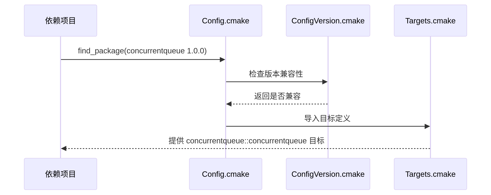

# using cmake compile ,build ,and package

## cmake 简介
cmake 是一个项目构建工具，通过一系列的描述，定义了C++程序的编译，构建，打包的规则，并且是跨平台的，已经成为一种普遍标准。

具体的命令不再赘述

## linux 

一个程序想要运行起来，需要经过编译阶段与连接阶段

编译阶段：进行语法检查，此时头文件发挥作用，生成目标文件 .o ，其中包含编译后的机器码和符号表
链接阶段：链接器会合并所有目标文件和库文件的符号表，静态库直接提供，动态库金提供符号应用，运行时加载。

所以在本项目的 cmakelists 中可以看到仅仅将头文件与库文件安装到了对应的位置。 
GNUInstallDirs 是 CMake 提供的一个标准模块，用于定义符合 GNU 编码标准的安装目录结构。

当安装好头文件与库文件后，库就已经妥当。

但是现在 C++ 代码在编译及链接的时候，不一定能够找到库的头文件以及库文件的位置，在使用 GCC 的时候可以显式得指定路径，在 cmake 中已经给我们提供了一种机制，流程如下。
1：一个标准的 CMakeLists 执行完或者是包安装后已经将库文件以及头文件安装到了GNUInstallDirs所定义的符合 GNU Coding Standards 和 Filesystem Hierarchy Standard (FHS) 的软件安装目录结构标准化路径变量的目录下
2：在编写一个项目的 CMakeLists 的时候，查找包时候，会调用find_package,find_package 会在默认路径下查找。
3: 并不是在查找包，而是在查找三个 .cmake 文件,三个文件分别起到如下作用

